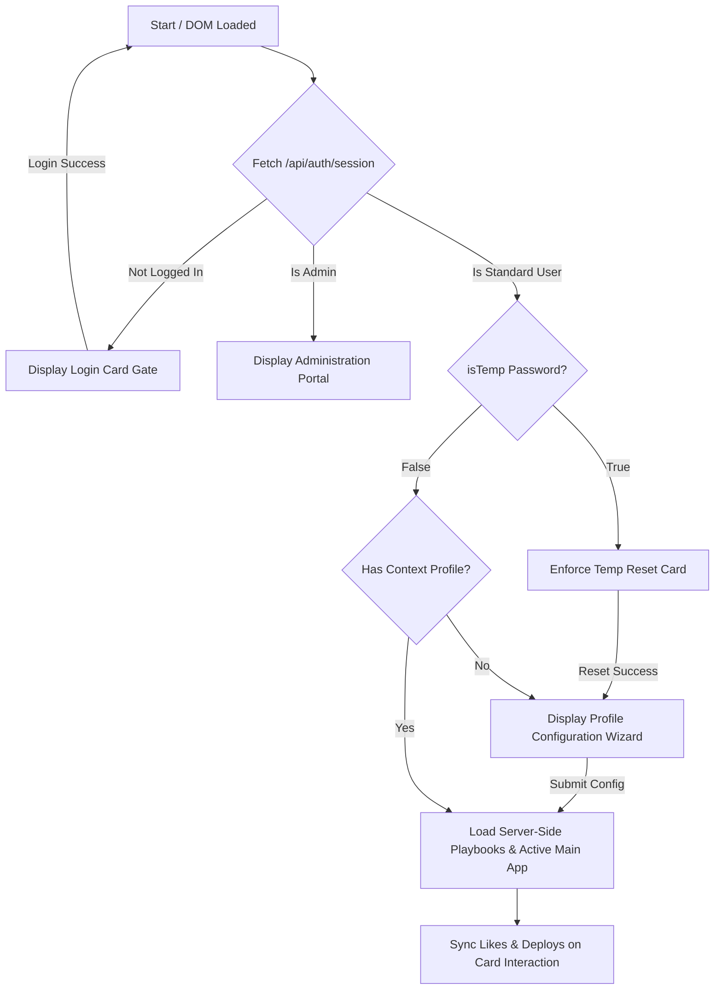

# Gemini Enterprise - Edu Portal Developer Guidelines (`AGENT.md`)

This document serves as the persistent single source of truth for the **Google Gemini Enterprise Education Adoption & Playbook Portal**. It outlines the technology stack, specific coding and terminology preferences, design guidelines, and the current implementation state.

---

## 1. Technology Stack & Architecture

The application is built as a high-fidelity, dynamic web application supported by a secure containerized Node.js backend.

* **Backend Server:** Node.js + Express framework (`server.js`) powering dynamic REST APIs, session storage, and database management.
* **Dual Database Layer:**
  * **Production (PostgreSQL):** Production-ready pool configuration (`pg`) optimized for container scaling on Google Cloud Run.
  * **Local/Offline Fallback (SQLite):** File-based SQLite (`edu_portal.db`) with automatic table structures creation.
* **VM Sandbox Seeding Module:** Securely parses and extracts 14 static scholastic/operational playbooks and translations from `app.js` on first boot inside an isolated Node `vm` context, eliminating seed duplication. Includes a 6-month historical log generator to populate visual analytics out-of-the-box.
* **Authentication Gateways:** Enforced via `express-session` cookies and `bcryptjs` hashing.
  * **Admin Account:** `hk_edu_admin` with password `eduHK2026`.
  * **Standard Accounts:** Email-based provisioning with auto-generated 10-character temp passwords. Force-reset of credentials is strictly enforced on first login.
* **Markup & Client Logic:** Vanilla HTML5 paired with modular ES6+ client-side logic (`app.js`). Hydrates page templates dynamically from `/api/use-cases` on session validation.
* **Styles & Visual Identity:** Pure Swiss Minimalism Vanilla CSS (`style.css`), powered by CSS variable maps. **TailwindCSS is strictly avoided** to preserve precise typographic scale and structural grids.

---

## 2. Terminology & Brand Boundaries

Strict guidelines govern how features, products, and connectors are named. These boundaries must be strictly observed in all UI elements and translations:

### Approved Terminology
* **Enterprise Title:** `Gemini Enterprise - Edu Portal` (Avoid *"Antigravity"* or general references).
* **Main Models & Features:** `NotebookLM` (Never refer to it as *"NotebookLM Enterprise"*), `Gemini`, `Canvas Mode`, `Deep Research`, `Agent Designer`, `Image Generation` (Never use *"Nano Image Gen"*), `Video Generation`.

### Forbidden Terminology
* **Never** use the term **"Gem"** (always use **"Agent"**).
* **Never** use the term **"Copilot"**.

### Localization Boundary
* Keep product and system names (*NotebookLM*, *Gemini*, *Canvas Mode*, *Deep Research*, *Agent Designer*, *Image Generation*, *Video Generation*) strictly in **English** within both Traditional Chinese (`zh-TW`) and Simplified Chinese (`zh-CN`) translations.

---

## 3. Design Aesthetics & Legibility Rules

The portal is designed with a premium, state-of-the-art aesthetic that shifts dynamically between light and dark modes:

* **Dark/Light Mode Theme Variable Management:**
  * Backgrounds, borders, and main cards are driven by CSS variables (e.g., `--bg-primary`, `--border-glass`).
  * Ggradient title elements (like `.welcome-msg`) use dynamic color variables (`var(--welcome-msg-start)` and `var(--welcome-msg-end)`) to prevent low-contrast text failures in light mode. In light mode, headings shift gracefully to elegant dark slate/steel colors rather than retaining light/white gradients.
* **Icon Softening:**
  * Utility icons inside side panels and secondary items use soft muted colors (`var(--text-muted)`) rather than stark black/white colors, ensuring a quiet, premium aesthetic that lights up elegantly on active hover states.
* **No Placeholders:**
  * Standard icons are rendered using the Google Material Symbols Outlined font library.
  * Overlapping UI buttons (such as the **Copy Prompt** button in the sandbox drawer) are properly padded to ensure clear separation and zero element overlapping.

---

## 4. Connector & Dynamic State Logic

The portal supports intelligent integration simulation via simulated enterprise connector toggles:

* **Nomenclature:**
  * All connector components are named generically in user-facing toasts and badges to ensure product agnosticism (e.g., **Drive Connector**, **Email Connector**, **Calendar Connector**, **LMS Connector**) rather than referencing vendor-specific software (like *Outlook* or *OneDrive*).
* **Essential Connectors vs. Optional Connectors:**
  * Use cases that strictly require an active integration (e.g., **Daily Academic Email Digest & Priority Planner**) carry a `connectorEssential: true` tag. These cards strictly show a locked overlay on the dashboard when their corresponding connector is toggled off.
  * Use cases where integrations are secondary enhancements (e.g. *Sentiment Feedback*, *Activities Calendar*) are tagged with `connectorEssential: false`. These cards remain **unlocked** on the dashboard and accessible to click at all times.
* **Modal Advanced Toggle:**
  * Inside the detailed modal view for non-essential connector use cases, an interactive slider checkbox ("Extend to Advanced Usage with Connectors") is rendered.
  * Toggling this checkbox instantly swaps the steps, prompts, and pro-tips between standard manual file upload variants and active cloud connector workflows.

---

## 5. Current Implementation State

The following dynamic authorization, session gating, and admin workflows are 100% verified, compiled, and operational:

* **Instant Translation Chain:** Language switches translate the full portal, sidebar filters, active user context metrics, and interactive toasts in real-time.
* **Product-Agnostic Notifications:** Simulating connectors issues clean native toasts, fully localized across English (`en`), Traditional Chinese (`zh-TW`), and Simplified Chinese (`zh-CN`).
* **Interactive Preferences (Likes/Deployments):** Standard use case cards carry responsive heart and rocket icons that bypass detail popups, updating preference tables dynamically on the server database.
* **SVG Vector Graph Charts:** The admin statistics view aggregates database events and paints high-contrast line charts showing Page Views, Likes, and Deployments over the last 6 months.

---

### 6. App State & Progress
 
### Accomplished Tasks (Latest Session Milestone)
* **Standard Test Account Programmatic Auto-Seeding:** Integrated automatic checking and seeding inside `seedDatabase` in `server.js` to ensure the default test account `test-user@google.com` (password `12345678`, role `Lecturer`, level `University & College`) is programmatically seeded on database start if missing. This guarantees standard account availability for testing across database resets.
* **Full Field Integration for Active-Integration Advanced Prompts:** Extended the administrator template editing form (`#adminCaseEditModal`) inside `index.html` to fully support editing advanced procedural steps, advanced prompts, and advanced pro-tips for English, Traditional Chinese (`zh-TW`), and Simplified Chinese (`zh-CN`).
* **Linked Admin Form Data Flows to Database:** Refactored `openAdminCaseForm()` and `saveAdminUseCase()` inside `app.js` to correctly load existing advanced fields from database objects, parse steps into neat line-by-line arrays, and save changes cleanly back to the database as unified translation envelopes.
* **Onboarding Use Case Auto-Fetch:** Resolved the structural gap where completing onboarding for the first time resulted in an empty dashboard. Added `await loadUseCasesFromServer()` inside `handleOnboardingSubmit()` prior to rendering to instantly fetch and display matched templates.
* **State Persistence Across Page Refreshes:** Implemented robust session-state persistence utilizing `sessionStorage`:
  * Highlighting and maintaining active category, feature, and status filters across page refreshes.
  * Preserving the user's active view (retaining logged-in admins simulating the standard user learning portal instead of forcing them back to the admin dashboard).
  * Remembering the admin's active dashboard tab selection (retaining focus on "Playbooks Templates" or "Analytics" across page reloads).
* **Defensive Connector Toggle Safety:** Hardened `setupConnectorToggles()` in `app.js` with optional-chaining and element presence guards to protect against null reference exceptions when initializing standard elements.
 
### Next Steps & Continuous Polish
1. **Performance Tuning:** Optimize database query indexes in PostgreSQL schema configs for faster retrieval of translation envelopes.
2. **Cloud Run Production Scaling:** Set optimal container scaling and CPU allocation targets for highly active traffic hours.
3. **Accessibility Audits:** Review ARIA tags and color contrast metrics of the glassmorphism layout components across all devices.
