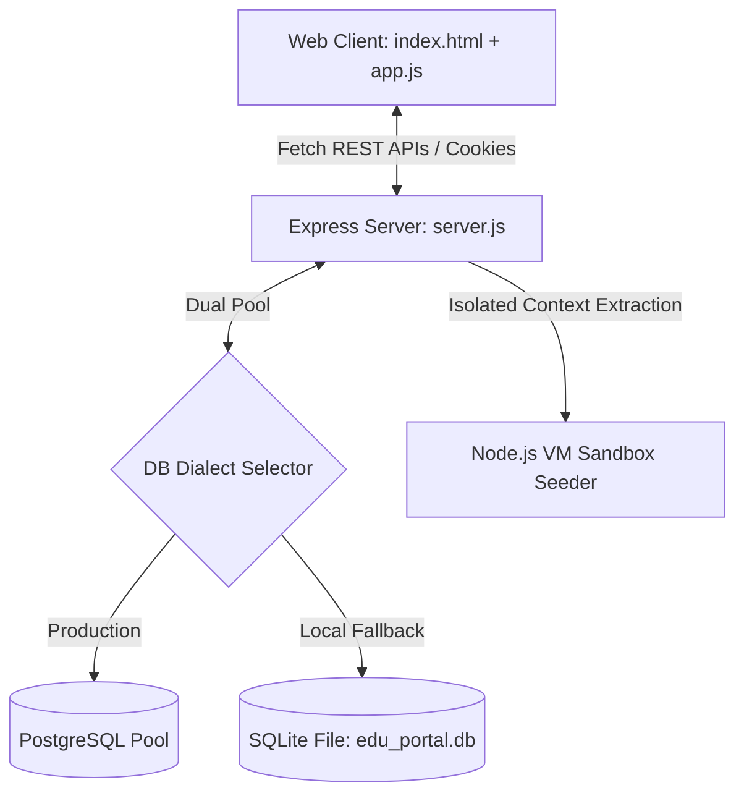

# Gemini Enterprise - Academic Adoption & Playbook Portal

[](#cloud-production-deployment)
[](#technology-stack)
[](#localization-dictionaries)

Welcome to the **Gemini Enterprise Edu Portal**, a high-fidelity, premium academic adoption roadmap and playbook orchestration platform. Custom-tailored for academic institutions, this system provides educational leaders, lecturers, support staff, and students with interactive, role-specific Gemini adoption pathways, interactive sandboxes, visual analytics, and persistent feedback collection loops.

---

## 📖 Table of Contents
1. [Core Features](#-core-features)
2. [Technology Stack](#-technology-stack)
3. [Architecture & DB Schemas](#-architecture--db-schemas)
4. [Role-Specific Onboarding & Workflows](#-role-specific-onboarding--workflows)
5. [Local Development & Setup](#-local-development--setup)
6. [Cloud Production Deployment](#-cloud-production-deployment)
7. [Version Control & Release Workflow](#-version-control--release-workflow)

---

## 🌟 Core Features

### 📅 Dual-Track Chronological Timeline (View A)
A symmetrical, highly structured horizontal roadmap divided into key academic semesters: *August*, *September*, *October – November 15*, and *November 16 – January 15*.
* **Track 1 (Semester-Restricted Milestones)**: Houses four color-coded phase nodes (Indigo, Amber, Emerald, Blue, Coral, Purple) complete with separate progress tracking bars (Tech Provisioning, Launch & Onboard, Evaluation Pilot, Exam Prep & Audit). Clicking nodes slides open a dynamic panel allowing supervisors to assign/unassign adoption playbooks.
* **Track 2 (Continuous Rolling Initiatives)**: Designed as a continuous, thick progress pipeline capsule with interactive arrowhead anchors to represent semester-independent rolling initiatives (e.g. Identity Providers & Connector Configurations).

### 🌀 Isometric SVG Winding Verification Pipeline (View B)
An advanced engineering checklist system built on top of a futuristic grid layout:
* **Metallic 3D Pipeline**: Drawn with linear gradient SVG sheets, sheen gloss layers, and connector rings.
* **Pulsating Joints**: 5 glowing joints pulsating matching specific timeline phases.
* **Reactive Strikethroughs**: Completing phase checklist tasks triggers automatic line strikethroughs, joint glows, and dynamically transforms node colors into brilliant emerald rings.

### 🧪 Advanced Prompt Sandbox & Diff Viewer
* **Dynamic Connectors**: Playbook cards simulate enterprise connector toggles (Drive, Email, Calendar, LMS). If an *essential* connector is toggled off, the card is locked with a modern frosted-glass overlay.
* **Advanced Usage**: Toggling the advanced connector mode dynamically swaps steps, complex prompt payloads, and pro-tips between manual operations and cloud API workflows.
* **Gemini LLM Prompt Refiner**: Submit prompt changes to a mock Gemini LLM, which renders side-by-side color-coded syntax Diff comparisons (Current Draft vs Optimized suggestions).

### 📊 Real-time Administrative Telemetry
* Fully responsive data administration console plotting high-contrast vector line charts of cumulative Page Views, Likes, and Deployments compiled over a rolling 6-month historical log.
* Dynamic user provisioning tools supporting automatic creation, temporary password force-resets, and role switching.

### 💬 Persistent Universal Feedback Loops
* A beautiful fixed floating feedback button styled with linear-gradient, scale-up micro-animations, and modern glassmorphism.
* Automatically records the submitter's email context and provides an exclusive **User Feedbacks** console inside the Admin dashboard, restricted solely to the super-admin account, supporting real-time suggestions review and dismissals (crossing-off).

---

## 🛠 Technology Stack

* **Client Engine**: Vanilla HTML5, ES6+ JavaScript modules, and Material Symbols font icons.
* **Visual Styling**: Swiss-minimalist Vanilla CSS (`style.css`) utilizing standard layout grids, CSS variable maps (supporting Light and Dark modes), and dynamic micro-animations. **TailwindCSS is strictly avoided** to preserve precise typography.
* **Server Framework**: Node.js + Express (`server.js`) supporting session tracking via secure cookies and Bcrypt authentication hashing.
* **Dual Database Layer**:
  * *Production*: Scaled PostgreSQL client pooling (`pg`) optimized for container scaling on Google Cloud.
  * *Development/Fallback*: File-based SQLite database engine (`edu_portal.db`) with automated schema bootstraps.
* **Isolated VM Sandbox Parser**: Uses a Node.js isolated `vm` context to extract and seed 14 static academic playbooks and translations directly from the client script (`app.js`) upon first boot, preventing data duplication.

---

## 🏗 Architecture & DB Schemas



### Database Schema Table Definitions

#### 1. Users Table (`users`)
Stores authorization credentials, context configurations, and force-reset onboarding status:
* `email` (Primary Key, VARCHAR/TEXT)
* `password_hash` (TEXT, Not Null)
* `is_temp_password` (BOOLEAN/INTEGER, Default True)
* `role` (VARCHAR/TEXT, Default Null)
* `institution_level` (VARCHAR/TEXT, Default Null)
* `created_at` (TIMESTAMP)

#### 2. Editable Playbooks (`use_cases`)
* `id` (Primary Key, VARCHAR/TEXT)
* `category` (VARCHAR/TEXT)
* `is_verified` (BOOLEAN/INTEGER, Default False)
* `translations` (JSONB/TEXT) - Holds multilingual strings.
* `likes` (INTEGER, Default 0)
* `deployments` (INTEGER, Default 0)

#### 3. User Feedbacks (`feedbacks`)
Manages suggestions sent by portal users:
* `id` (Primary Key, SERIAL/AUTOINCREMENT)
* `user_email` (VARCHAR/TEXT, Not Null)
* `feedback_text` (TEXT, Not Null)
* `created_at` (TIMESTAMP)

---

## 👥 Role-Specific Onboarding & Workflows

To ensure highly targeted adoptions, the portal dynamically adapts its roadmaps, checklists, analytics, and navigation sidebars according to the user's selected role:

| Role Code | User Role | Targeted Responsibilities | Accessible Hubs |
| :--- | :--- | :--- | :--- |
| `Lecturer` | **Lecturer / Educator** | Teaching material designs, student engagement, and content creation. | Academic Hub |
| `TA` | **Teaching Assistant (TA)** | Grading assistance, course administration, and tutorial sessions. | Academic Hub |
| `Student` | **Student / Club Leader** | Assignment reviews, study groups, and student activities. | Student Center |
| `Program Leader` | **Program Leader / Dept Head** | Curriculum design, program accreditation, and course coordination. | Academic Hub, Operational Command |
| `Dean` | **Dean / Educational Leader** | Strategic planning, academic audits, and faculty management. | Academic Hub, Operational Command |
| `SAO` | **Student Affairs Officer (SAO)** | Student support, extracurricular activities, and counseling. | Student Center, Operational Command |
| `Finance` | **Financial Administrator** | Budget planning, funding auditing, and procurement control. | Operational Command |
| `Security` | **Campus Security Officer** | Incident reporting, access logging, and emergency coordination. | Operational Command |
| `IT Admin` | **IT Administrator / SysAdmin** | Provisioning, identity configurations, and connector integrations. | Operational Command |

---

## 🚀 Local Development & Setup

### Prerequisites
* **Node.js** (v18.x or higher)
* **npm** (v9.x or higher)

### Installation
1. Clone the repository and navigate to the project directory:
   ```bash
   git clone <YOUR_REPOSITORY_URL>
   cd <YOUR_REPOSITORY_DIR_NAME>
   ```
2. Install package dependencies:
   ```bash
   npm install
   ```
3. Start the local Express server:
   ```bash
   npm run dev
   # or
   node server.js
   ```
4. Open your web browser and navigate to `http://localhost:3000`.

### Local Testing Accounts
* **Super-Admin**:
  * *Username/Email*: `<SUPER_ADMIN_USERNAME>`
  * *Password*: `<SUPER_ADMIN_PASSWORD>`
* **Assistant Admin**:
  * *Username/Email*: `<ASSISTANT_ADMIN_USERNAME>`
  * *Password*: `<ASSISTANT_ADMIN_PASSWORD>`

---

## ☁️ Cloud Production Deployment

The project can be deployed to **Google Cloud Run** for serverless container auto-scaling:

1. **Service Identity**: `<YOUR_CLOUD_RUN_SERVICE_NAME>`
2. **Project ID**: `<YOUR_GCP_PROJECT_ID>`
3. **Serving Region**: `<YOUR_GCP_REGION>`

To build and deploy new production releases, execute:
```bash
gcloud run deploy <YOUR_CLOUD_RUN_SERVICE_NAME> --source . --region <YOUR_GCP_REGION> --allow-unauthenticated --project <YOUR_GCP_PROJECT_ID>
```
*Note: This command builds your container using the root `Dockerfile` via Google Cloud Build and uploads the compiled image directly to Google Artifact Registry.*

---

## 📈 Version Control & Release Workflow

Development modifications are committed directly to the upstream repository. Use the following structured lifecycle to issue releases:

### Step 1: Version Control Sync
Stage, commit, and push your tested updates:
```bash
# Stage changes
git add .

# Create a professional commit message
git commit -m "feat: [Detailed change description]"

# Push commits to remote origin branch
git push
```

### Step 2: Live Serverless Deploy
Re-compile the application and launch the updated revision on Google Cloud Run:
```bash
gcloud run deploy <YOUR_CLOUD_RUN_SERVICE_NAME> --source . --region <YOUR_GCP_REGION> --allow-unauthenticated --project <YOUR_GCP_PROJECT_ID>
```

---

*Made with 💜 for advanced agentic software deployments.*
